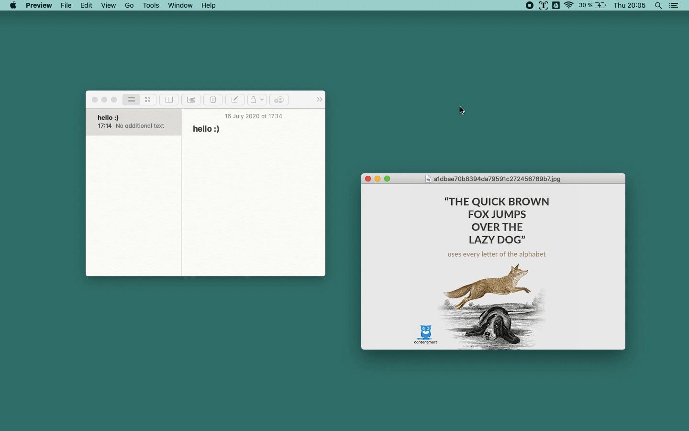

<h1 align="center">
  Pine
</h1>
<h4 align="center">A simple image to text OCR scanner for macOS</h4>
<p align="center">
  
</p>


## Features
- All text extraction is done locally
- Saves text to clipboard
- Supports dark mode
- It does one thing, and it does it well

## Installation
```python
# clone the repo
$ git clone https://github.com/sdushantha/pine.git

# change the working directory to pine
$ cd pine

# install the requirements
$ python3 -m pip install -r requirements.txt
```

To run Pine, just run this command:
```bash
python3 pine.py
```
